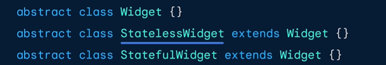

# Flutter Basics

## Day 1 — Flutter Basics

- [x] Day 1 completed
  - [Flutter Basics Overview](#flutter-basics-overview)
    - [What is Flutter?](#what-is-flutter)
    - [Dart](#dart)
    - [Declarative UI / Reactive Programming](#declarative-ui--reactive-programming)
    - [Multiplatform Development](#multiplatform-development)
    - [What exactly is State?](#what-exactly-is-state)
  - [The Widget Tree in Flutter](#the-widget-tree-in-flutter)
    - [Key Components of the Widget Tree](#key-components-of-the-widget-tree)
      - [Main Function](#main-function)
      - [Cupertino vs Material Widgets](#cupertino-vs-material-widgets)
    - [Flutter Rendering and UI Architecture](#flutter-rendering-and-ui-architecture)
  - [Difference between Stateless & Stateful widgets](#difference-between-stateless--stateful-widgets)
  - [Stateful Widget Lifecycle](#stateful-widget-lifecycle-initstate-dispose)
    - [How setState() triggers UI rebuilds](#how-setstate-triggers-ui-rebuilds)
  - [Text Changer App Example](#text-changer-app-example)
  - [Summary](#summary)

---

## Flutter Basics Overview

### What is Flutter?

Flutter is a declarative, reactive open-source, multiplatform UI toolkit developed by Google. It allows developers to build natively compiled applications for mobile, web, and desktop from a single codebase. Flutter uses the Dart programming language and provides a rich set of pre-designed widgets to create beautiful and responsive user interfaces.

Flutter developers often hear terms like everything in Flutter is a widget, and this is because Flutter's UI is built using a hierarchy of widgets called the widget tree. Widgets are the building blocks of a Flutter app's user interface, and they can be combined to create complex UIs.

### Dart

Dart is an open-source client-optimized programming language that compiles to the native machine code of the target platform without runtime overhead leading to fast startup times and predictable performance. It is designed to be easy to learn and use, with a syntax that is similar to other popular programming languages like Java, JavaScript, and C#. Dart is the primary language used for developing Flutter applications.

### Declarative UI / Reactive Programming

Flutter uses a declarative approach: you simply describe what the UI should look like for a given state (like color: blue). The framework then uses reactive programming to automatically react to state changes and rebuild the UI efficiently.

### Multiplatform Development

Multiplatform development refers to the ability to create applications that can run on multiple platforms using a single codebase. Flutter enables developers to build applications for iOS, Android, web, and desktop platforms using the same codebase, which significantly reduces development time and effort.

### What exactly is State?

  Now you may wonder what state is. In simple terms, state refers to the data or information that determines the behavior and appearance of a widget at a given time. For example, the state of a button widget may include whether it is enabled or disabled, its color, and its text label.

In Flutter, state can be managed in various ways, including using built-in stateful widgets, provider packages, or other state management solutions. The choice of state management technique depends on the complexity of the application and the specific requirements of the project. `More about state management will be discussed in the upcoming days.`

---

## The Widget Tree in Flutter

Now, as the interface of an application is built using widgets, those widgets are combined to create a widget tree. The widget tree is a hierarchical structure that represents the relationship between different widgets in the application. Each widget in the tree can have its own state, which can be updated and managed independently.

When the state of a widget changes, Flutter automatically rebuilds the affected parts of the widget tree to reflect the new state. This is done using a process called `rebuilding,` which involves creating a new instance of the widget with the updated state and replacing the old instance in the widget tree.

This process is efficient and allows for smooth and responsive user interfaces, as only the affected parts of the widget tree are rebuilt, rather than the entire tree which facilitates the hot reload feature in Flutter.

### Key Components of the Widget Tree

The widget tree is structured in a hierarchical manner, with each widget having a parent-child relationship with other widgets. The root of the tree is typically the `MaterialApp` or `CupertinoApp` widget, which serves as the entry point for the application. From there, other widgets are added as children of the root widget, forming a tree-like structure.

#### Main Function

The `main` function is the entry point of a Flutter application. It is where the execution of the app begins. In the `main` function, we typically call the `runApp` function, which takes a widget as an argument and inflates it to fill the screen.

#### Cupertino vs Material Widgets

  Flutter provides two sets of pre-designed widgets: Material widgets and Cupertino widgets. Material widgets are designed to follow the Material Design guidelines developed by Google, while Cupertino widgets are designed to follow the iOS design guidelines developed by Apple. Depending on the target platform, developers can choose to use either set of widgets or a combination of both to create a consistent user experience across different platforms.

### Flutter Rendering and UI Architecture

  Flutter initially renders the UI using skia, a 2D graphics rendering engine. Skia is responsible for drawing the UI elements on the screen, and it provides a high-performance rendering pipeline that allows for smooth animations and transitions. But with the release of Flutter 3.0, Flutter introduced a new rendering engine called Impeller, which is designed to provide even better performance and visual fidelity. Impeller is a next-generation rendering engine that leverages modern graphics APIs like Metal on iOS and Vulkan on Android to deliver high-quality graphics and smooth animations.

Flutter's rendering and UI architecture is primarily built upon three main trees:

1. **Widget Tree**: The widget tree is the hierarchical structure of widgets that make up the user interface of a Flutter application. Each widget in the tree represents a specific UI element, such as a button, text field, or image. The widget tree is responsible for defining the layout and appearance of the UI.

2. **Element Tree**: The element tree is a lower-level representation of the widget tree. It consists of `Element` objects, which are created for each widget in the widget tree (Like a copy of the widget). The element tree is responsible for managing the lifecycle of widgets, including their creation, updating, and destruction. It also handles the communication between widgets and their associated state.

3. **Render Tree (or RenderObject Tree):**: The render tree is the final representation of the UI that is used for painting on the screen. It consists of `RenderObject` instances, which are responsible for the actual layout and painting of the UI elements. The render tree is built from the element tree and is optimized for performance and efficiency during the rendering process.

In summary,

- The Widget is the structural description of the UI (Blueprint). it is the `immutable` description of what the UI should look like and provides configuration and hierarchy.

- The Element is the `mutable` brain that manages the lifecycle of the widget and holds the state. It acts as a bridge between the widget and the render object. Determines what needs to be updated when the widget's state changes.

- The Render Object is Builder/Artist that is responsible for the actual layout and painting(drawing pixels) of the UI on the screen. It takes care of measuring, positioning, and drawing the visual representation of the widget.

The interaction between these three trees is crucial for the efficient rendering of the UI in Flutter. When a widget's state changes, Flutter updates the widget tree, which in turn updates the element tree and the render tree. This process ensures that only the affected parts of the UI are redrawn, leading to smooth and responsive user interfaces.

## Difference between Stateless & Stateful widgets

The widget tree can be broadly categorized into two types of widgets based on their ability to manage state:

1. **Stateless Widgets**: These are widgets that do not maintain any state. Once built, their appearance and behavior are fixed and cannot change. Stateless widgets are typically used for static content that does not require user interaction or dynamic updates.

2. **Stateful Widgets**: These are widgets that can maintain state over time. They can rebuild themselves when their state changes, allowing for dynamic and interactive user interfaces. Stateful widgets are used for content that needs to change in response to user input or other events.

Other kinds of widgets include:

- **Inherited Widgets**: These widgets allow data to be passed down the widget tree efficiently. They are used for sharing data between widgets without the need for explicit passing through constructors. examples include `Theme` and `MediaQuery`.

- **Render Objects**: These are low-level objects responsible for the actual layout and painting of the UI. They are created and managed by the Flutter framework based on the widget tree.

## Stateful Widget Lifecycle (initState, dispose)

Stateful widgets have a lifecycle that consists of several stages, each represented by specific methods that can be overridden to perform actions at different points in the widget's life. The key lifecycle methods of a stateful widget are:

1. **createState()**: This method is called when the stateful widget is first created. It returns an instance of the associated `State` class, which holds the mutable state for the widget.

2. **initState()**: This method is called after the stateful widget is created and before the widget is built for the first time. It is used to perform any initializations that are required for the state.

3. **didChangeDependencies()**: Called immediately after `initState()`, but before the widget is built for the first time. It's also called when an InheritedWidget that this State depends on changes. It is often a good place to initialize data that depends on the BuildContext (like Theme.of(context)), as initState() may be too early.
4. **build()**: This method is called whenever the widget needs to be rebuilt, either due to a change in state or when the parent widget rebuilds. It returns the widget tree that represents the UI of the stateful widget.

5. **setState()**: (Triggered by you) This method is used to notify the framework that the state of the widget has changed and that it needs to be rebuilt.
6. **didUpdateWidget()**: This method is called whenever the parent widget rebuilds and passes new configuration data down to the child stateful widget. It allows the state to respond to changes in the widget's properties by passing the updated stateful widget as a parameter.

The image above illustrates how calling `setState()` leads to the invocation of the `build()` method, when the user hits enter after inputing a city name in the TextField. it fetches new weather data and updates the UI accordingly.
7. **deactivate()**: This method is called when the State object is removed from the Element tree, but before it is disposed. This might happen temporarily if the widget is moved to a different part of the tree.
8. **dispose()**: This is called after deactivate() when the State object is permanently removed from the tree. This is the last method called, and it's essential to use it for cleanup (e.g., canceling timers, unsubscribing from streams, disposing of controllers) to prevent memory leaks.

The image above shows the `dispose()` method being called when the `StatefulWidget` which is a TextFormField controller is removed from the widget tree after a user submits a form. This ensures that resources are properly released and prevents memory leaks.

### How setState() triggers UI rebuilds

The `setState()` method is a crucial part of the stateful widget lifecycle in Flutter. When you call `setState()`, you are indicating to the Flutter framework that the internal state of the widget has changed and that the widget needs to be rebuilt to reflect those changes in the UI.
When `setState()` is called, the following sequence of events occurs:

1. The callback function passed to `setState()` is executed, allowing you to update the state variables of the widget.
2. After the state has been updated, Flutter marks the widget as needing to be rebuilt.
3. The framework schedules a rebuild of the widget tree, starting from the stateful widget that called `setState()`.
4. During the rebuild process, the `build()` method of the stateful widget is called, which constructs a new widget tree based on the updated state.
5. The framework compares the new widget tree with the previous one and determines which parts of the UI need to be updated.
6. Finally, the framework updates the UI by redrawing only the affected parts of the widget tree, resulting in a smooth and efficient update to the user interface.

## Text Changer App Example

Click [Here to view the Text Changer App Explanation.](./text_changer/README.md) to view the Text Changer App Explanation.

## Summary

In summary, the three trees in Flutter's rendering architecture work together to create a responsive and efficient UI. The widget tree defines the structure and appearance of the UI, the element tree manages the lifecycle and state of the widgets, and the render tree is responsible for the actual painting of the UI on the screen. Understanding these trees and their interactions is key to building performant Flutter applications.
