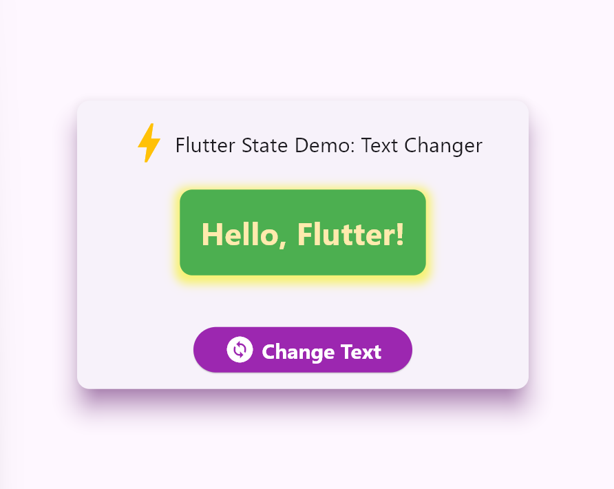
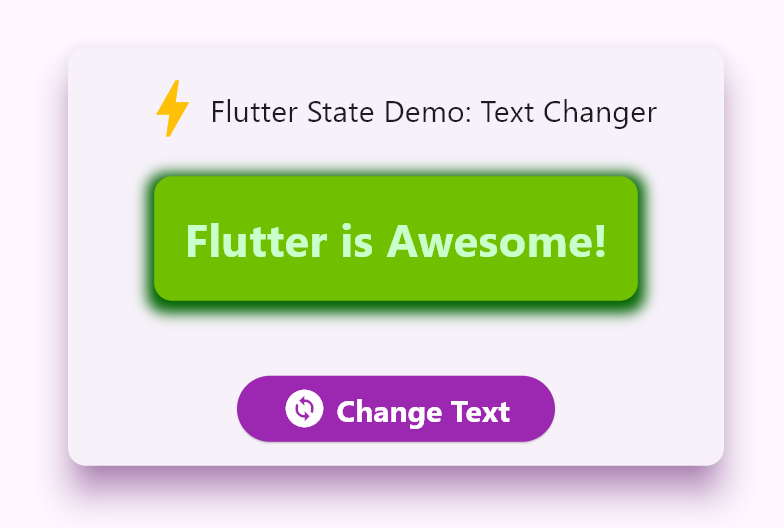

# Text Changer — Flutter State Demo

This small Flutter sample demonstrates how to use a `StatefulWidget` and `setState()` to change on-screen text and animate visual changes. It's ideal for beginners learning how Flutter updates the UI in response to internal state changes.

## What the app does (short)

- Shows a title and a colored rounded box containing a line of text.
- When the user taps the "Change Text" button, the text toggles between two messages and the box's color and shadow animate smoothly.

## Why this is useful to learn

- Teaches the difference between `StatelessWidget` and `StatefulWidget`.
- Shows how `setState()` triggers rebuilds.
- Demonstrates a simple animation with `AnimatedContainer` for simple UI animations without an animation controller.

## Files

- `lib/main.dart` — the entire sample app is in this file. Open it to follow the code examples.

## Key concepts (beginner-friendly)

- Stateless vs Stateful:
  - `StatelessWidget` (used by `MyApp`) is for UI that doesn't change by itself.
  - `StatefulWidget` (used by `ChangeText`) has an associated `State` object where mutable data (like `isChanged`) lives.
- `setState()`:
  - Call `setState(() { ... })` to change variables and tell Flutter to rebuild the widget tree for that `State` object.
- `AnimatedContainer`:
  - A container that smoothly animates between visual states (colors, shadows, sizes) when its properties change.

### How the code works (walk-through)

1. `main()` launches the app with `runApp(const MyApp());`.
2. `MyApp` builds a `MaterialApp` and a simple layout (a `Card` with an icon/title and the `ChangeText` widget).
3. `ChangeText` is a `StatefulWidget`. Its `State` class `_ChangeTextState`:

- Declares `late bool isChanged;` which stores whether the alternate message is shown. You can also initialize it directly (e.g. `bool isChanged = false;`) without `initState()`, but I just used `late` for demonstrating `initState()` and how it runs before `build()`. `Late` means the variable is non-nullable (can't be null) but will be initialized later.
- Sets `isChanged = false;` inside `initState()` so the app starts with the default text.
- The `displayText()` method returns one of two strings based on `isChanged` value.
- Builds the UI containing an `AnimatedContainer` (shows the text) and an `ElevatedButton.icon`.

1. When the button is pressed, `onPressed` calls:

  ```dart
  setState(() {
   isChanged = !isChanged; // Toggles between true/false
  });
  ```

  That toggles the boolean and causes Flutter to call `build()` again. Because `AnimatedContainer` sees that its decoration/color changed, it animates the transition over 300 milliseconds.

### Run the app (quick)

Click "Run" in your IDE or use the terminal:

```bash
flutter run
```

### Small experiments to try

- Change the two messages to your own phrases.
- Replace `AnimatedContainer` with `Container` to observe the difference (no animation).
- Add a third state by using an `int` or `enum` instead of a `bool` to cycle through multiple messages.

---



